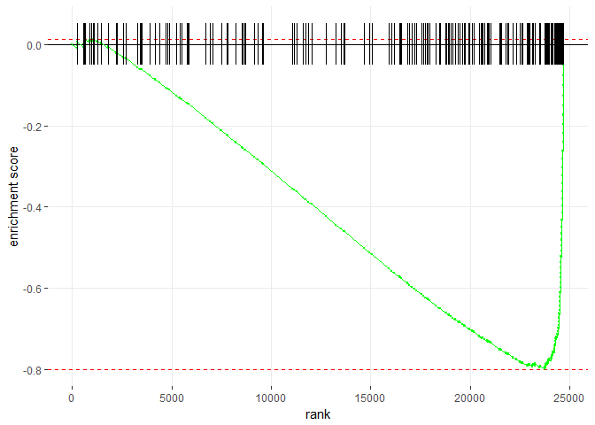
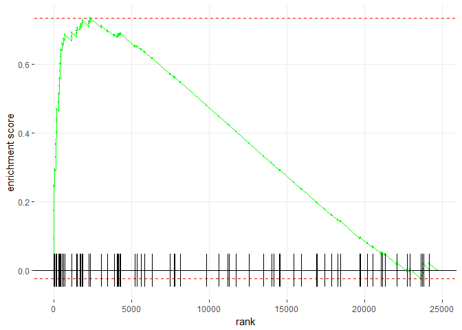
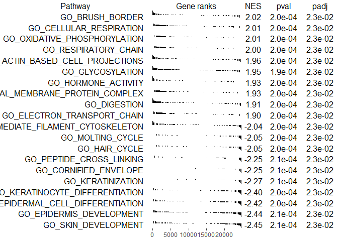

Gene set enrichment analysis
================

-   [Introduction](#introduction)
-   [2x2 (Fisher's exact) methods](#x2-fishers-exact-methods)
-   [Camera](#camera)
-   [Roast](#roast)
-   [fGSEA](#fgsea)

Introduction
------------

This document outlines how to do gene set enrichment analysis and similar techniques. Such procedures are designed to look in your data set for changes in groups of genes ("gene sets") that have been predetermined to be interesting and coregulated. Finding enriched groups of genes can help to make sense of the data. It can also find changes in groups of genes that are too small to find on the level of the individual genes (e.g. the individual genes aren't differentially regulated, but the set of them might be enriched).

Resources:

-   <https://support.bioconductor.org/p/74755/>
-   <http://bioinformatics.oxfordjournals.org/content/23/8/980.long>

### General approaches

There are three general approaches to this problem:

<table style="width:103%;">
<colgroup>
<col width="18%" />
<col width="12%" />
<col width="72%" />
</colgroup>
<thead>
<tr class="header">
<th align="left">Approach</th>
<th align="left">Genes used</th>
<th align="left">No difference between...</th>
</tr>
</thead>
<tbody>
<tr class="odd">
<td align="left">Fisher's exact</td>
<td align="left">Just DEG</td>
<td align="left">... proportion of DE genes inside and outside set</td>
</tr>
<tr class="even">
<td align="left">Competitive null</td>
<td align="left">All</td>
<td align="left">... genes inside and outside set</td>
</tr>
<tr class="odd">
<td align="left">Self-contained</td>
<td align="left">Just set</td>
<td align="left">No gene in gene set is DE</td>
</tr>
</tbody>
</table>

-   Fisher's exact test, uses just differentially expressed genes (are more of my differentially expressed genes in this gene set than I would expect by chance?)
-   Competitive null, uses all genes, compares genes in set to genes not in set (are genes in the set ranked more highly by fold change than genes outside the set?)
-   Self-contained, uses genes in set, compared to fixed standard (is any gene in the gene set differentially expressed?)

#### Overview

[Comments from James MacDonald:](https://support.bioconductor.org/p/74755/) "The biggest difference (IMO) between the Fisher's exact test and the various gene set tests is that the results from a Fisher's exact 'look more real' to the average biologist as compared to the results of a gene set test. In other words, for the Fisher's exact test you have a set of genes that you are saying are significantly differentially expressed, and then just seeing if a gene set has more significant genes than you would expect by chance. So you are starting out with genes that you (and more importantly, your collaborator or PI) consider truly differentially expressed.

For the other gene set tests you are instead either ranking the genes by a statistic and testing if the gene set is higher or lower in the ranking than you would expect by chance (competitive gene set test), or you are testing that at least one gene in the set is significant (self-contained gene set test). In both cases most if not all of the genes may not actually be significantly differentially expressed. That can be a hard sell - it can be difficult to explain to non-statisticians how a set of genes, most of which aren't differentially expressed, can in aggregate be significant."

### Data sets

To illustrate these procedures with a simple data set, we'll compare paired biopsies from the rectum and vagina from human donors, to try and determine how these two different tissue types (squamous vs. columnar) and sites differ. The data set is stored as `filtered` and the sample information is stored as `mapping` (one row of `mapping` per column of `filtered`). Probes that were not expressed in at least 10% of the samples have already been removed, which is why it's called `filtered`, but it includes both probes that are differentially expressed and those that aren't.

We'll look for enrichment of all the [gene ontology (GO) gene sets]((http://bioinf.wehi.edu.au/software/MSigDB/)) from MSigDB. These are stored as a list called `Hs.c5`.

``` r
library(limma)
library(dplyr)
mapping <- read.csv("data/mapping.csv")
load("data/filtered.Rda")
load("data/human_c5_v5p2.rdata")
```

2x2 (Fisher's exact) methods
----------------------------

1.  Calculate differentially expressed genes
2.  Divide genes into 4 categories based on differential expression and membership in a given set or not
3.  Calculate a p-value for overrepresentation of the gene set among the differentially expressed genes (Fisher's exact, chi-squared, binomial z-test for proportions, permutation)

Differential gene expression analysis:

``` r
# First, you have to do the differential gene expression analysis, 
# because you need to know which genes in your experiment are 
# differentially expressed
ptid <- factor(mapping$Ptid)
tissues <- factor(mapping$SampleType)
design <- model.matrix(~ 0 + tissues + ptid)
contrasts <- makeContrasts(RectumMinusVagina = tissuesRectal - tissuesVaginal, 
   levels = design)
fit <- lmFit(filtered, design)
fit <- contrasts.fit(fit, contrasts)
fit <- eBayes(fit)
tt <- topTable(fit, coef = "RectumMinusVagina", n = Inf, p = 0.05, lfc = 0.5)
```

Once you have calculated the differentially expressed *probes*, you need to combine the duplicates.

``` r
# if duplicate probes go in multiple directions, remove that gene
# otherwise collapse probes to genes
tt <- tt %>% 
   group_by(ENTREZ_GENE_ID) %>% 
   mutate(unidirectional = length(unique(logFC < 0)) == 1) %>% 
   filter(unidirectional) %>% 
   summarise(Direction = ifelse(logFC < 0, "Down", "Up")[1])

down <- filter(tt, Direction == "Down")
up <- filter(tt, Direction == "Up")
```

There are 1769 downregulated genes and 2043 upregulated genes.

#### Example 2x2 table

|                            | In set | Not in set |
|----------------------------|--------|------------|
| Differentially expressed   | 33     | 2010       |
| Not differentially express | 53     | 16755      |

This example table shows that of the 2043 differentially expressed genes, 33 (1.6%) are in the set. In contrast, only 53 (0.3%) of the 16808 non-differentially expressed genes were in the set.

### Perform Fisher's exact test

It's pretty annoying to extract numbers for the 2x2 table by hand. The function below does it for you from a data frame containing differentially regulated genes, a vector containing the entrez IDs for a gene set, and an expression set

``` r
fisher <- function(differentially_regulated, gene_set, e_set, 
      display_table = FALSE) {
   all_genes <- unique(fData(e_set)$ENTREZ_GENE_ID)
   all_diff <- differentially_regulated$ENTREZ_GENE_ID
   non_diff <- all_genes[!(all_genes %in% all_diff)]
   
   # remove genes from gene set that aren't expressed in our array
   # if you don't do this, you need to adjust below in order to 
   # reflect these genes
   # Just removing them (as done here) is a questionable thing to do
   # alternative approach is to assign all the genes in the set not 
   # expressed in our array to the non differentially expressed, but 
   # in set group, as here
   # non_diff_in_set <- gene_set[!(gene_set %in% diff_in_set)] 
   gene_set <- gene_set[gene_set %in% all_genes]
      
   # build the four elements of the 2x2 table
   diff_in_set <- all_diff[all_diff %in% gene_set]
   non_diff_in_set <- non_diff[non_diff %in% gene_set]
   diff_not_in_set <- all_diff[!(all_diff %in% gene_set)]
   non_diff_not_in_set <- non_diff[!(non_diff %in% gene_set)]

   # put the number of genes in each of the four elements into matrix form
   m <- matrix(c(length(diff_in_set), length(non_diff_in_set), 
      length(diff_not_in_set), length(non_diff_not_in_set)), ncol = 2)
   
   # make sure the numbers add up correctly
   stopifnot(length(diff_in_set) + length(diff_not_in_set) == length(all_diff))
   stopifnot(length(non_diff_in_set) + length(non_diff_not_in_set) ==
         length(non_diff))
   stopifnot(length(diff_in_set) + length(non_diff_in_set) == length(gene_set))
   
   if (display_table) {
      print(m)
   }
   
   # perform the test
   # alternative = "greater" means we're looking for enrichment of the
   # differentially expressed genes within the set
   # could also test for the opposite
   fisher.test(m, alternative = "greater")
}

# test down-regulated genes for enrichment in keratinization and brush border
# we expect keratinization to be enriched in the down-regulated genes (because
# the rectum is less keratinized than the vagina)
fisher(down, Hs.c5[["GO_KERATINIZATION"]], filtered)
```

    ## 
    ##  Fisher's Exact Test for Count Data
    ## 
    ## data:  m
    ## p-value < 2.2e-16
    ## alternative hypothesis: true odds ratio is greater than 1
    ## 95 percent confidence interval:
    ##  15.55664      Inf
    ## sample estimates:
    ## odds ratio 
    ##   30.49454

``` r
fisher(down, Hs.c5[["GO_BRUSH_BORDER"]], filtered)
```

    ## 
    ##  Fisher's Exact Test for Count Data
    ## 
    ## data:  m
    ## p-value = 0.5645
    ## alternative hypothesis: true odds ratio is greater than 1
    ## 95 percent confidence interval:
    ##  0.4768944       Inf
    ## sample estimates:
    ## odds ratio 
    ##  0.9903468

``` r
# test up-regulated genes for enrichment in keratinization and brush border
# we expect brush border to be enriched in the up-regulated genes (because
# the brush border is a feature of columnar epithelium (as in the rectum)
# and not of squamous epithelium as in the vagina)
fisher(up, Hs.c5[["GO_KERATINIZATION"]], filtered)
```

    ## 
    ##  Fisher's Exact Test for Count Data
    ## 
    ## data:  m
    ## p-value = 1
    ## alternative hypothesis: true odds ratio is greater than 1
    ## 95 percent confidence interval:
    ##    0 Inf
    ## sample estimates:
    ## odds ratio 
    ##          0

``` r
fisher(up, Hs.c5[["GO_BRUSH_BORDER"]], filtered)
```

    ## 
    ##  Fisher's Exact Test for Count Data
    ## 
    ## data:  m
    ## p-value = 2.248e-11
    ## alternative hypothesis: true odds ratio is greater than 1
    ## 95 percent confidence interval:
    ##  3.492762      Inf
    ## sample estimates:
    ## odds ratio 
    ##   5.189469

Camera
------

``` r
# GO gene sets
# Each element of the list is a GO gene set
# Each element inside a set is the entrez ID of a gene in that set

# Each element of the vector is the entrez id of the probe in the 
# corresponding row of my exprs
identifiers <- as.character(fData(filtered)[ , "ENTREZ_GENE_ID"])

# Each element of the index list corresponds to a GO gene set above
# Inside each element is the row numbers in my exprs that correspond to
# each gene in the gene set (Hs.c5)
index <- ids2indices(gene.sets = Hs.c5, identifiers)

tissue <- factor(mapping$SampleType)
ptid <- factor(mapping$Ptid)
design <- model.matrix(~ 0 + tissue + ptid)
# contrasts argument can either the name of a coef from design
# or a contrasts object with one single coef
contrasts <- makeContrasts(
   RectumMinusVagina = tissueRectal - tissueVaginal,
   levels = design)

# If you don't specify an inter.gene.cor, the default is to assign 0.01 for all 
# gene sets. Inter-gene correlations are NOT estimated separately for each set.
# In this case, sets of highly correlated genes can still appear at the top of 
# the list. 
GO_GSEA <- camera(y = exprs(filtered), index = index, 
   design = design, contrast = contrasts)

head(GO_GSEA)
```

    ##                                 NGenes Direction       PValue          FDR
    ## GO_CORNIFIED_ENVELOPE               39      Down 5.882016e-22 3.626851e-18
    ## GO_KERATINIZATION                   45      Down 1.862615e-18 5.742441e-15
    ## GO_KERATINOCYTE_DIFFERENTIATION    100      Down 1.801129e-17 3.701921e-14
    ## GO_SKIN_DEVELOPMENT                221      Down 5.932925e-13 7.630267e-10
    ## GO_PEPTIDE_CROSS_LINKING            49      Down 6.187372e-13 7.630267e-10
    ## GO_EPIDERMIS_DEVELOPMENT           276      Down 1.519292e-12 1.561326e-09

``` r
# If you specify NA for inter.gene.cor, it will estimate a correlation for each 
# gene set. Gene sets that are highly correlated are unlikely to appear at the 
# top of the list because they get strongly adjusted for. For example, 
# GO_CORNIFIED_ENVELOPE has an intergene correlation of 0.18, so it doesn't
# appear in the top of the list below any more
GO_GSEA <- camera(y = exprs(filtered), index = index, 
   design = design, contrast = contrasts, inter.gene.cor = NA)

head(GO_GSEA)
```

    ##                                   NGenes   Correlation Direction
    ## GO_SKIN_DEVELOPMENT                  221  0.0137311182      Down
    ## GO_KERATINOCYTE_DIFFERENTIATION      100  0.0352292388      Down
    ## GO_ACTION_POTENTIAL                   73 -0.0002996404        Up
    ## GO_EPIDERMAL_CELL_DIFFERENTIATION    150  0.0186056748      Down
    ## GO_EPIDERMIS_DEVELOPMENT             276  0.0214497759      Down
    ## GO_ANION_HOMEOSTASIS                  48 -0.0057142724        Up
    ##                                         PValue       FDR
    ## GO_SKIN_DEVELOPMENT               4.875272e-05 0.3006093
    ## GO_KERATINOCYTE_DIFFERENTIATION   1.442263e-04 0.3518569
    ## GO_ACTION_POTENTIAL               2.172593e-04 0.3518569
    ## GO_EPIDERMAL_CELL_DIFFERENTIATION 2.348407e-04 0.3518569
    ## GO_EPIDERMIS_DEVELOPMENT          2.853202e-04 0.3518569
    ## GO_ANION_HOMEOSTASIS              4.591794e-04 0.4083133

``` r
# In the documentation for camera, they say that using the default of 0.01 "gives 
# a useful compromise between strict error rate control and interpretable gene 
# set rankings"
```

Roast
-----

``` r
# Roast is does simulation/rotation based tests for gene sets
# mroast does multiple sets, whereas roast does just one set (e.g. index[[1]])
# otherwise the arguments are the same as for camera
GO_GSEA <- mroast(y = exprs(filtered), index = index, 
   design = design, contrast = contrasts)
head(GO_GSEA)
```

    ##                                                   NGenes  PropDown
    ## GO_CORNIFIED_ENVELOPE                                 39 0.9487179
    ## GO_ACETYL_COA_BIOSYNTHETIC_PROCESS                    17 0.0000000
    ## GO_CYTOSOLIC_PROTEASOME_COMPLEX                       15 0.9333333
    ## GO_PROTEASOME_REGULATORY_PARTICLE_BASE_SUBCOMPLEX     20 0.9000000
    ## GO_OLIGOSACCHARIDE_CATABOLIC_PROCESS                  10 0.1000000
    ## GO_KERATINIZATION                                     45 0.8888889
    ##                                                       PropUp Direction
    ## GO_CORNIFIED_ENVELOPE                             0.00000000      Down
    ## GO_ACETYL_COA_BIOSYNTHETIC_PROCESS                0.94117647        Up
    ## GO_CYTOSOLIC_PROTEASOME_COMPLEX                   0.00000000      Down
    ## GO_PROTEASOME_REGULATORY_PARTICLE_BASE_SUBCOMPLEX 0.00000000      Down
    ## GO_OLIGOSACCHARIDE_CATABOLIC_PROCESS              0.90000000        Up
    ## GO_KERATINIZATION                                 0.02222222      Down
    ##                                                   PValue         FDR
    ## GO_CORNIFIED_ENVELOPE                              0.001 0.001168246
    ## GO_ACETYL_COA_BIOSYNTHETIC_PROCESS                 0.001 0.001168246
    ## GO_CYTOSOLIC_PROTEASOME_COMPLEX                    0.001 0.001168246
    ## GO_PROTEASOME_REGULATORY_PARTICLE_BASE_SUBCOMPLEX  0.001 0.001168246
    ## GO_OLIGOSACCHARIDE_CATABOLIC_PROCESS               0.001 0.001168246
    ## GO_KERATINIZATION                                  0.001 0.001168246
    ##                                                   PValue.Mixed FDR.Mixed
    ## GO_CORNIFIED_ENVELOPE                                    0.001     0.001
    ## GO_ACETYL_COA_BIOSYNTHETIC_PROCESS                       0.001     0.001
    ## GO_CYTOSOLIC_PROTEASOME_COMPLEX                          0.001     0.001
    ## GO_PROTEASOME_REGULATORY_PARTICLE_BASE_SUBCOMPLEX        0.001     0.001
    ## GO_OLIGOSACCHARIDE_CATABOLIC_PROCESS                     0.001     0.001
    ## GO_KERATINIZATION                                        0.001     0.001

fGSEA
-----

``` r
library(fgsea)
# The input to fgsea is log fold change values, sorted in ascending order, as 
# a vector. The name of each element should be the corresponding entrez gene ID
# To get this, first you have to do a DEG analysis. 
fit <- lmFit(filtered, design)
fit <- contrasts.fit(fit, contrasts)
fit <- eBayes(fit)
tt <- topTable(fit, coef = "RectumMinusVagina", n = Inf) %>% 
   arrange(logFC)

ranks <- tt$logFC
names(ranks) <- tt$ENTREZ_GENE_ID
ranks <- ranks[!is.na(names(ranks))]

# The pathways input to the function is a list just like for camera. Each gene
# should be identified with the same kind of name as the names for the log fold
# change vector above. In this case, Hs.c5 is fine as is. 
fg <- fgsea(pathways = Hs.c5, stats = ranks, nperm = 10000, maxSize = 500)
# put in nice order for evaluation
fg <- arrange(fg, padj, desc(abs(NES)))

fg %>% 
   # remove list of genes for printing clarity
   select(-leadingEdge) %>% 
   head()
```

    ##                             pathway         pval       padj         ES
    ## 1               GO_SKIN_DEVELOPMENT 0.0002058884 0.02262184 -0.8162399
    ## 2          GO_EPIDERMIS_DEVELOPMENT 0.0002055498 0.02262184 -0.7990252
    ## 3 GO_EPIDERMAL_CELL_DIFFERENTIATION 0.0002031694 0.02262184 -0.8516500
    ## 4   GO_KERATINOCYTE_DIFFERENTIATION 0.0002044990 0.02262184 -0.8876360
    ## 5                 GO_KERATINIZATION 0.0002066970 0.02262184 -0.9519643
    ## 6             GO_CORNIFIED_ENVELOPE 0.0002054232 0.02262184 -0.9699700
    ##         NES nMoreExtreme size
    ## 1 -2.448374            0  170
    ## 2 -2.441195            0  203
    ## 3 -2.422710            0  112
    ## 4 -2.402845            0   80
    ## 5 -2.271879            0   37
    ## 6 -2.254186            0   31

``` r
# plot individual pathway
plotEnrichment(Hs.c5[["GO_EPIDERMIS_DEVELOPMENT"]], ranks)
```



``` r
plotEnrichment(Hs.c5[["GO_BRUSH_BORDER"]], ranks)
```



``` r
# plot group of pathways
topPathwaysUp <- fg %>% 
   filter(ES > 0) %>% 
   slice(1:10) %>% 
   .$pathway

topPathwaysDown <- fg %>% 
   filter(ES < 0) %>% 
   slice(1:10) %>% 
   .$pathway

topPathways <- c(topPathwaysUp, rev(topPathwaysDown))
plotGseaTable(Hs.c5[topPathways], ranks, fg, gseaParam = 0.5)
```


